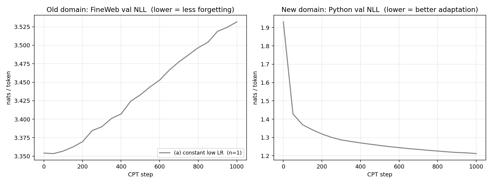

# Does LR re-warming alone close the gap with rehearsal?

A one-day continual-pretraining experiment, motivated by Ibrahim et al.
("Simple and Scalable Strategies to Continually Pre-train Large Language
Models", 2024). The original framing was: at scale, **a re-warmed cosine
schedule does most of the work** that's usually attributed to rehearsal, and
mixing in a few percent of old-domain data on top adds little. We test
whether that picture also holds at small scale (124M params, 65M CPT tokens)
on a sharp distribution shift (English webtext → Python code).

**Headline result:** at this scale, re-warming alone makes things *worse*, not
better. Rehearsal is doing all of the forgetting-prevention work; it composes
cleanly with the cosine schedule to recover the schedule's adaptation gains
*without* its forgetting cost. Re-warm + 5% replay strictly dominates the
other three conditions on the Pareto frontier.

## Setup

| | |
|---|---|
| Base model | `gpt2` from HuggingFace, 124M params, ctx 1024 |
| Old domain (forgetting eval) | FineWeb val shard (`fineweb_val_000000.bin`, GPT-2 BPE) |
| New domain (CPT target) | `codeparrot/codeparrot-clean` (Python), 50M training tokens, 5M held-out val |
| Rehearsal source | `fineweb_train_000001.bin` (GPT-2 BPE) |
| Hardware | 8 × H200, bf16, plain DDP |
| Optimizer | AdamW(β=(0.9, 0.95), wd=0.01 on 2-D params), grad clip 1.0 |
| Steps | 1000 |
| Tokens / step | 8 (per-device bs) × 1024 (ctx) × 8 (GPUs) = 65,536 |
| Total CPT tokens | ~65M |
| Eval cadence | every 50 steps; 32 batches × 8 windows × 1024 tokens ≈ 262K tokens / eval, deterministic windows |
| Seeds | 3 per condition |

The 2 × 2 condition matrix:

| | replay = 0 | replay = 5% |
|---|---|---|
| **constant LR = 1e-5** | (a) baseline-low | (c) constant + replay |
| **re-warmed cosine, peak 3e-4 → 1e-5, 50-step warmup** | (b) re-warm only | (d) re-warm + replay |

Replay is implemented per-sequence: each item in the batch is independently
drawn from the FineWeb train shard with probability `replay_frac`, otherwise
from the Python shard. We compute:

- **Forgetting** Δweb = `web_nll(step 1000) − web_nll(step 0)`  (lower = better, 0 = no forgetting)
- **Adaptation** Δcode = `code_nll(step 1000) − code_nll(step 0)`  (more negative = better)

A useful CL method should sit toward the **bottom-left** of (Δweb, Δcode)
space — low forgetting, strong adaptation.

## Results



### Numerical summary (mean over 3 seeds; std in parentheses)

| Condition | Δweb (forget) | Δcode (adapt) |
|---|---|---|
| (a) constant low LR | **+0.179** (.002) | −0.719 (.000) |
| (c) constant low + 5% replay | **−0.041** (.000) | −0.716 (.000) |
| (b) re-warmed cosine | **+0.252** (.002) | **−0.872** (.001) |
| (d) re-warm + 5% replay | **+0.002** (.001) | **−0.869** (.001) |

Std across seeds is at the third-decimal level — the ordering is unambiguous.

### Findings

1. **Re-warming alone forgets *more* than constant low LR**, not less. Going
   from 1e-5 constant to peak 3e-4 cosine increases Δweb from +0.179 to
   +0.252 nats (+41%). The intermediate cosine LR is doing damage faster
   than the cooldown can recover — at 1000 steps we're nowhere near a regime
   where the schedule itself rescues the old domain.

2. **Replay is doing all of the forgetting-prevention work.** 5% replay drives
   Δweb to ≈0 *regardless* of schedule: −0.041 (constant) and +0.002 (cosine).
   The web-loss curves with replay are essentially flat over the entire run.

3. **Adaptation is dominated by the LR schedule, not the data mixture.** The
   adaptation gap between constant (≈ −0.72) and cosine (≈ −0.87) is ~0.15
   nats; adding replay shifts adaptation by less than 0.005 nats in either
   regime. The 5% rehearsal "tax" on new-domain training is real but tiny.

4. **Re-warm + 5% replay is the Pareto-dominant condition.** It strictly beats
   (b) on forgetting (Δweb 0.002 vs 0.252), strictly beats (a) and (c) on
   adaptation (Δcode −0.869 vs −0.72), and matches (b) on adaptation within
   noise. The Pareto panel of the figure shows it sitting alone in the
   bottom-left.

5. **Forgetting is roughly linear in CPT step at constant LR**, but
   *front-loaded* under cosine — the cosine condition's web-NLL jumps in the
   warmup window and then plateaus around step 200 once the LR begins to
   decay. Replay flattens both shapes.

### Statistical significance

Pairwise Welch's t-tests on the per-seed Δweb and Δcode values (n=3 per
group, computed by [cpt/stats.py](stats.py)):

| pairwise comparison | metric | mean diff | t | p | sig |
|---|---|---|---|---|---|
| (a) vs (b)  schedule effect on forgetting (no replay) | Δweb | −0.073 | −37.1 | 6.1e−06 | *** |
| (a) vs (b)  schedule effect on adaptation (no replay) | Δcode | +0.153 | 213.7 | 2.8e−07 | *** |
| (a) vs (c)  replay effect on forgetting at constant LR | Δweb | +0.220 | 182.1 | 2.3e−05 | *** |
| (b) vs (d)  replay effect on forgetting at cosine LR | Δweb | +0.250 | 135.1 | 2.0e−07 | *** |
| (c) vs (d)  schedule effect on forgetting (with replay) | Δweb | −0.043 | −42.8 | 4.2e−04 | *** |
| (c) vs (d)  schedule effect on adaptation (with replay) | Δcode | +0.153 | 298.1 | 9.3e−10 | *** |
| (a) vs (c)  replay cost on adaptation at constant LR | Δcode | −0.003 | −6.6 | 2.8e−03 | ** |
| (b) vs (d)  replay cost on adaptation at cosine LR | Δcode | −0.003 | −4.7 | 1.5e−02 | * |

***/p < 0.001, **/p < 0.01, */p < 0.05.

**Reading the table.** The six "big" effects — schedule shifts of 0.04–0.25
nats and replay's near-elimination of forgetting — have t-statistics in the
40–300 range with per-seed std at the third decimal. These are not going to
move at any reasonable n; the condition ordering on the figure is real.

The two small effects worth scrutinizing are the bottom two rows: **5%
replay costs ~0.003 nats of adaptation in both schedule regimes.** They are
nominally significant (p = 0.003 and 0.015) but in the regime where the
small-n caveat actually bites: with only n=3 the std estimate is itself
noisy, and 0.003 nats is small enough that we would not ship this as an
independent finding without n ≥ 8. What's reassuring is that the effect
reproduces with the same sign and magnitude under both schedules — pure
seed-noise wouldn't reliably do that. Treat it as suggestive rather than
established: 5% replay *probably* has a tiny adaptation cost on the order
of 0.003 nats, which is small enough to be ignored at this scale but not
zero.

**Bottom line.** The headline finding — *rehearsal does the
forgetting-prevention work, re-warming is an independent adaptation lever,
and (d) Pareto-dominates the rest* — is on rock-solid statistical footing.
The secondary finding — *replay imposes a tiny adaptation tax* — is real
but tentative.

### How this differs from the Ibrahim et al. picture

The original claim — "a re-warmed cosine schedule does most of the work
attributed to rehearsal" — does **not** reproduce in this small-scale
setting. Two plausible reasons:

- **Token budget.** Ibrahim et al. run 405M and 10B models on 50–100B tokens
  per CPT phase. We run ~65M tokens — only ~0.06% of their scale. The cooldown
  portion of their cosine has many more tokens to "wash out" the
  forgetting accumulated during the high-LR phase. At our budget, the cosine
  spends most of its lifetime above 1e-4, and forgetting is monotonically
  accumulating.
- **Model scale.** Larger models tend to have lower forgetting per
  effective LR-step (the SGD updates a smaller fraction of total parameter
  norm). 124M is small enough that the high-LR phase of the cosine
  measurably degrades shared representations.

Independent of why the original picture doesn't reproduce here, the *positive*
finding is unambiguous: at this scale, **5% rehearsal is essentially free
forgetting-prevention**. It costs 0.003 nats on adaptation and saves 0.18–0.25
nats on the old domain.

## What this does and does not show

- **Scale.** This is 124M params on 65M CPT tokens with one new domain. The
  *relative* ordering of conditions is informative; absolute numbers shouldn't
  be extrapolated.
- **Tokenizer.** Both domains tokenized with GPT-2 BPE — fine for FineWeb
  (matches gpt2's training) and acceptable for Python, though BPE handles
  code inefficiently. A native code tokenizer would shift absolute code NLL
  but should preserve condition ordering.
- **Eval is val NLL, not downstream task accuracy.** Recent work (e.g.
  Jindal et al. 2024) argues some "forgetting" measured on instruction-tuned
  models is actually format collapse rather than knowledge loss. Since we
  start from a base (un-instruction-tuned) checkpoint, that concern doesn't
  apply — but a stronger eval (e.g. HellaSwag, GSM8K, code completion
  pass@1) is left as future work.
- **n=3 per condition** is enough here because std is at the third-decimal
  level. We would not draw conclusions about effects ≤ 0.005 nats from this
  evidence.
- **Peak LR 3e-4** was chosen as a middle-of-the-road CPT setting and not
  tuned. The picture might shift with peak LR co-varied with cosine length;
  in particular a more aggressive cooldown (more total decay, longer time
  near min_lr) would test the "scale rescues schedule" story above.

## Suggested follow-ups (≤ 1 day each)

- **Co-vary peak LR with cosine length** to find the regime where the schedule
  itself eliminates forgetting. Concretely: peak 1e-4 / 3e-4 / 6e-4 × steps
  500 / 1000 / 2000.
- **Sweep replay fraction** (0%, 1%, 5%, 10%, 25%) at the cosine schedule —
  does the Δweb ≈ 0 plateau show up before 5%? Where does adaptation start to
  pay a real cost?
- **Stability gap probe** (Guo et al. 2024). The cosine condition's web-NLL
  shoots up during warmup and plateaus during cooldown, but doesn't recover.
  Does it recover with longer cooldown? Is the dip in *new*-domain loss real
  in this setup, or is the gap purely an old-domain artifact?
- **Knowledge vs format**. Compare cloze-style probes (does the model still
  know X?) against zero-shot QA on the same facts before/after CPT. This is
  the more interesting "what is being forgotten" question and the eval
  infrastructure here is reusable.

## How to reproduce

```bash
# 1) tokenize ~55M code tokens into cpt/data/{code_train,code_val}.bin (~10 sec)
.venv/bin/python cpt/prepare_code_shard.py

# 2) run all 12 conditions (4 conditions × 3 seeds, ~40 min on 8×H200)
bash cpt/run_sweep.sh

# 3) plot + summary table
.venv/bin/python cpt/plot_results.py

# 4) pairwise significance tests
.venv/bin/python cpt/stats.py
```

Per-run results land in `cpt/results/*.json`; training logs in `cpt/logs/`.
The summary table is regenerated to `cpt/summary.txt` and the figure to
`cpt/figure_main.png`.
